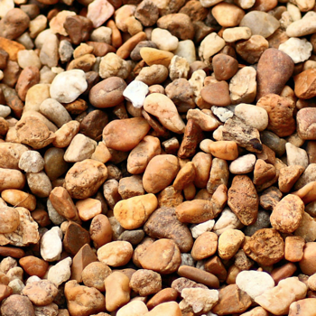
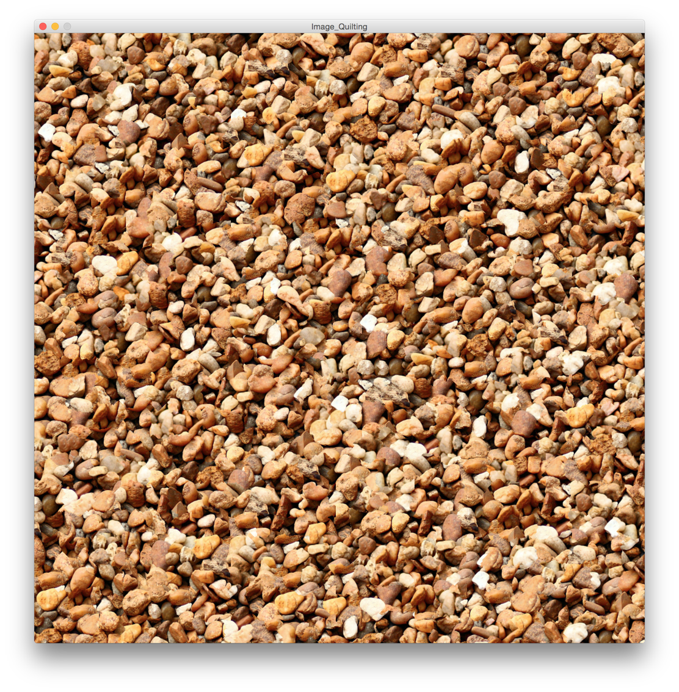
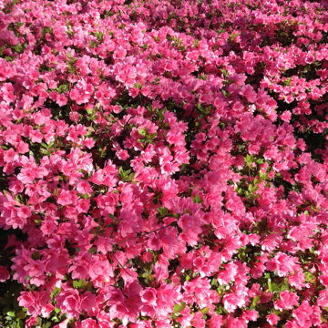
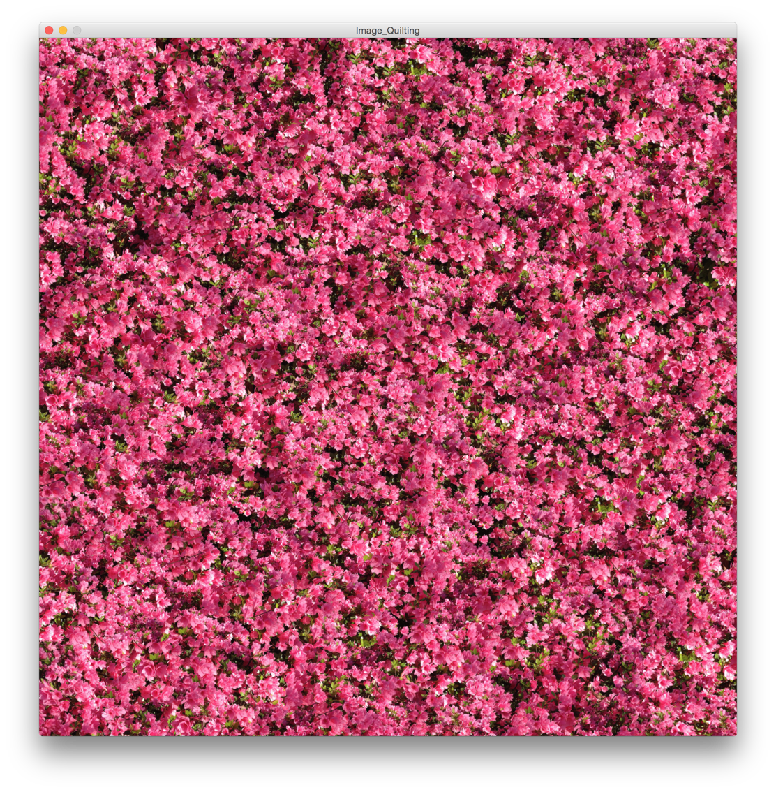
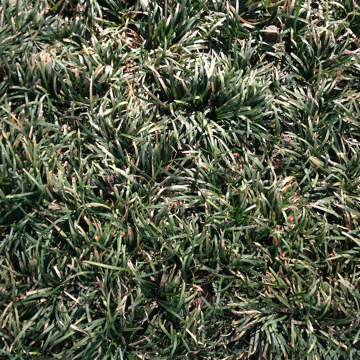
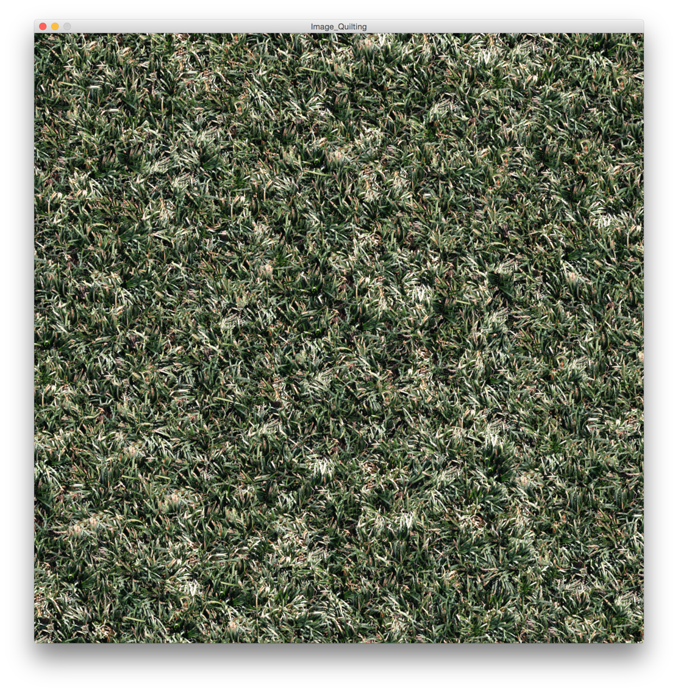

## Texture Synthesis with Image Quilting and Wang Tiles

Well... ok, just image quilting for now. :) 

Image quilting was described by Effros and Freeman in a 2001 paper that you can find [on this page](http://www.eecs.berkeley.edu/~efros/).

Basically, starting with a small image, you can quilt samples of it together in a clever way such as to create a large image that does not appear to be made from tiles or even from repeated sections of a small image.  For example, starting with this image of gravel:

We can generate this image:

More examples...

source image:

result:

source image:

result:

